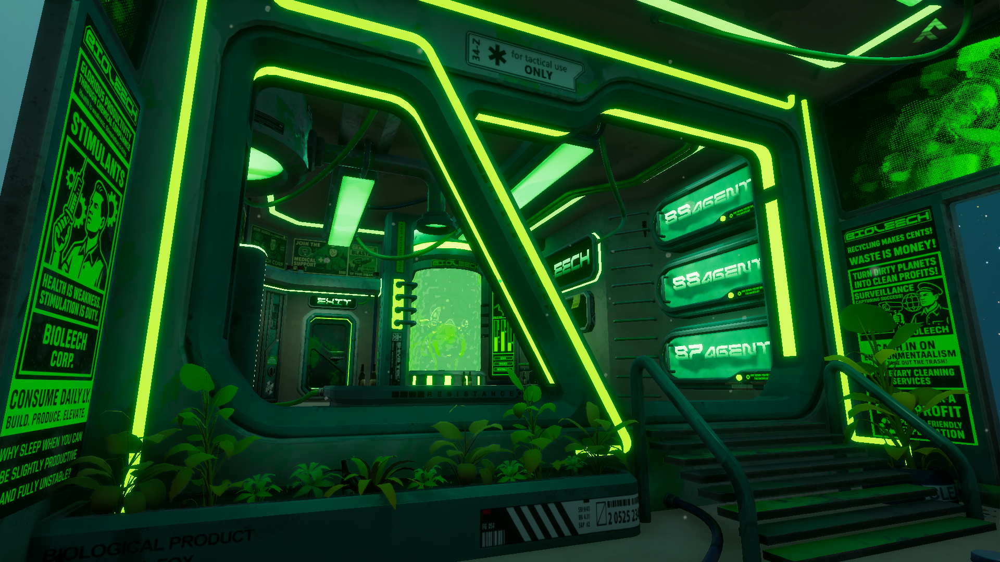

# BIOLEECH – General Project Readme

## Project Overview

This repository contains all the custom C# scripts developed by the author for **BIOLEECH**.    
These scripts cover gameplay mechanics, weapon systems, UI updates, visual effects, QTEs, player interactions, and other core functionalities.

## Important Disclaimer

This repository does **NOT** contain the complete game project.  
Assets, scenes, and other game elements are **not included**. Only the scripts developed by the author are present.

**Please note:** Scripts for certain game mechanics are also **not included**, as they were created by other developers and are outside the scope of this repository.

## Scripts Organization

Scripts are grouped by functionality:

- [**Gamepad_Vibrator**](/Gamepad_Vibrator): Handles gamepad vibration effects and haptic feedback throughout the game.  
- [**MAYA_AI**](/MAYA_AI): Scripts for MAYA, the game AI, including controllers, tutorial logic, text box animations, audio spectrum effects, jokes, and announcements. Includes the dialogue CSV (used in Unity) and a visual Excel/PDF for reference.
- [**Map**](/Map): Allows player interaction with the environment (slime meshes, checkpoints, sky events).  
- [**Menus**](/Menus): Game UI, including credit screens, main menu, hover animations, fades, and aesthetic element transitions.  
- [**Player**](/Player): Player-related scripts such as aiming, crosshair control, door controllers, mesh switching, teleportation, and upgrade systems.  
- [**Procedural_Animation**](/Procedural_Animation): Procedural adjustments like aligning character’s feet to terrain.  
- [**Ship**](/Ship): Ship-related scripts, including in-game computer text effects, floating effects, and screen controllers.  
- [**Tutorial**](/Tutorial): Scripts for tutorials: animations, visual effects, tutorial zone indicators, and step-by-step tutorial manager.  
- [**UI**](/UI): In-game UI control, including full-screen glitch effects, glitch animator control, and player stimulants display.  
- [**Weapon**](/Weapon): Weapon-related scripts including main weapon controller, QTE burner mechanics, hit zone management, slime suction, ammo/tank UI, shooting logic, and additional effects like FOV changes, weapon sway, and recoil.

Each script contains inline comments explaining complex parts and an optional **header README** describing its functionality and responsibilities.

## How to Use

1. Add the scripts to your Unity project under `Assets/Scripts/`.  
2. Assign required references (e.g., `Camera`, `Animator`, `TextMeshProUGUI`, `ParticleSystem`) in the Inspector.  
3. Configure public settings for gameplay mechanics (speeds, ranges, durations, etc.).  
4. Ensure that dependent scripts (e.g., `FPControllerWeapon`, `SlimeWeaponController`) are present in the scene.  
5. Review script-specific READMEs (if available) for detailed usage notes.

## Notes & Recommendations

- Some scripts assume specific GameObject names in the scene (e.g., `"Player"`, `"RenderWeapon"`, `"NumStimsText"`).  
- Scripts have been tested on Unity 6 (6000.0.34f1) with HDRP. Adaptation may be required for URP, Built-in pipeline, or other Unity versions.
- This repository focuses on gameplay scripting and does not include 3D models, textures, audio files, or scenes.  
- Some mechanics rely on external scripts not included in this repository.
  
## Watch BIOLEECH

The following screenshots display BIOLEECH gameplay and environments:

  
  
  

The official BIOLEECH trailer is available on:

- **Youtube:** [BIOLEECH Trailer](https://www.youtube.com/watch?v=nHOf3z3SQaQ)

## Play BIOLEECH

BIOLEECH is available for download and play on the following platform:

- **Itchio:** [BIOLEECH Page](https://desalichaostudio.itch.io/bioleech)

## Collaborators

While this repository contains only the scripts developed by the author, BIOLEECH is a collaborative project with contributions from other developers, artists, and designers.  

For more information and links to the team, visit the official Desalichao Studio Linktree:

- **Linktree:** [Desalichao Studio](https://linktr.ee/desalichaostudio)

## Author & Contact

**Author:** Víctor Rosell Gascó

- **Gmail:** codeby.vrosell@gmail.com  
- **Portfolio:** [codebyvrosell.com](https://x.com/codeby-vrosell)   
- **Twitter:** [@codeby_vrosell](https://x.com/codeby-vrosell)  
- **GitHub:** [@codeby-vrosell](https://github.com/codeby-vrosell)  
- **LinkedIn:** [in/v-rosell](https://linkedin.com/in/v-rosell)

## License

This repository is provided under a permissive license for educational and personal use.  
You are free to use, modify, and distribute the code.

**Please note:** While not required, crediting the author is appreciated when using these scripts in your own projects.
